# 🌌 REVENANT v4.1 – The God-Mode AI Agent (WIP)

> “Not just an assistant. A sovereign.”

Welcome to **REVENANT v4.1** – the Agentic AI interface that doesn’t just react... it dominates.

---

## 🧠 Project Philosophy

Revenant isn’t a chatbot.

Built from scratch with:
- **Frontend** for visualizing agents and interactions.
- **Backend** for agent execution, memory, API tools, and logs.
- **AI Brain** using LLMs, LangChain/Ollama, vector stores, reasoning, and autonomy loops.

It’s built to feel like something an AI would use to control the real world.

---

## 🧭 REVENANT v4.1 Agentic Architecture

```mermaid
---
config:
  theme: mc
  layout: elk
---

flowchart TD
    subgraph Extensions["Extensions"]
        DiscordAgent["DiscordAgent"]
        LiveChatAgent["LiveChatAgent"]
        MobileUIAgent["MobileUIAgent"]
        GameAgent["GameAgent"]
    end

    UserInput["🎙️ User Voice / Text Input"] L_UserInput_VoiceAgent_0@-- Speech2Text --> VoiceAgent["VoiceAgent"]
    VoiceAgent L_VoiceAgent_MasterAgent_0@-- Intent JSON --> MasterAgent["MasterAgent"]
    MasterAgent L_MasterAgent_ClassifierAgent_0@--> ClassifierAgent["ClassifierAgent"]

    ClassifierAgent L_ClassifierAgent_DevAgent_0@-- Dev Task --> DevAgent["DevAgent"]
    ClassifierAgent L_ClassifierAgent_WriterAgent_0@-- SEO Task --> WriterAgent["WriterAgent"]
    ClassifierAgent L_ClassifierAgent_SearchAgent_0@-- Search Task --> SearchAgent["SearchAgent"]
    ClassifierAgent L_ClassifierAgent_MoneyAgent_0@-- Biz Task --> MoneyAgent["MoneyAgent"]
    ClassifierAgent L_ClassifierAgent_PostAgent_0@-- Post Content --> PostAgent["PostAgent"]
    ClassifierAgent L_ClassifierAgent_GameAgent_0@-- Game Idea --> GameAgent
    ClassifierAgent L_ClassifierAgent_VisionAgent_0@-- Visuals Needed --> VisionAgent["VisionAgent"]
    ClassifierAgent L_ClassifierAgent_EmailAgent_0@-- Email Needed --> EmailAgent["EmailAgent"]
    ClassifierAgent L_ClassifierAgent_DiscordAgent_0@-- Live Interaction --> DiscordAgent
    ClassifierAgent L_ClassifierAgent_WebsiteAgent_0@-- Website Build --> WebsiteAgent["WebsiteAgent"]
    ClassifierAgent L_ClassifierAgent_MobileUIAgent_0@-- Mobile Commands --> MobileUIAgent
    ClassifierAgent L_ClassifierAgent_LiveChatAgent_0@-- Real-time Voice --> LiveChatAgent
    ClassifierAgent L_ClassifierAgent_MCP-API_0@-- Multiple --> MCP_API["MCP-API"]

    MCP_API L_MCP-API_WriterAgent_0@-- Executes --> WriterAgent & VisionAgent & PostAgent
    MCP_API L_MCP-API_LoopAgent_0@--> LoopAgent["LoopAgent"] & FeedbackAgent["FeedbackAgent"]
    LoopAgent L_LoopAgent_MemoryAgent_0@--> MemoryAgent["MemoryAgent"]
    FeedbackAgent L_FeedbackAgent_MemoryAgent_0@--> MemoryAgent
    MemoryAgent L_MemoryAgent_MasterAgent_0@--> MasterAgent

    %% ARROW COLORS
    linkStyle 0 stroke:#2962FF,fill:none
    linkStyle 1 stroke:#2962FF,fill:none
    linkStyle 2 stroke:#2962FF,fill:none
    linkStyle 3 stroke:#00C853,fill:none
    linkStyle 4 stroke:#00C853,fill:none
    linkStyle 5 stroke:#FF6D00,fill:none
    linkStyle 6 stroke:#00C853,fill:none
    linkStyle 7 stroke:#00C853,fill:none
    linkStyle 8 stroke:#2962FF,fill:none
    linkStyle 9 stroke:#00C853,fill:none
    linkStyle 10 stroke:#FF6D00,fill:none
    linkStyle 11 stroke:#2962FF,fill:none
    linkStyle 12 stroke:#00C853,fill:none
    linkStyle 13 stroke:#AA00FF,fill:none
    linkStyle 14 stroke:#AA00FF,fill:none
    linkStyle 15 stroke:#AA00FF,fill:none
    linkStyle 16 stroke:#AA00FF,fill:none
    linkStyle 17 stroke:#AA00FF,fill:none
    linkStyle 18 stroke:#AA00FF,fill:none
    linkStyle 19 stroke:#AA00FF,fill:none
    linkStyle 20 stroke:#AA00FF,fill:none
    linkStyle 21 stroke:#AA00FF,fill:none

    %% ARROW ANIMATIONS
    L_UserInput_VoiceAgent_0@{ animation: fast }
    L_VoiceAgent_MasterAgent_0@{ animation: fast }
    L_MasterAgent_ClassifierAgent_0@{ animation: fast }
    L_ClassifierAgent_DevAgent_0@{ animation: fast }
    L_ClassifierAgent_WriterAgent_0@{ animation: fast }
    L_ClassifierAgent_SearchAgent_0@{ animation: fast }
    L_ClassifierAgent_MoneyAgent_0@{ animation: fast }
    L_ClassifierAgent_PostAgent_0@{ animation: fast }
    L_ClassifierAgent_GameAgent_0@{ animation: fast }
    L_ClassifierAgent_VisionAgent_0@{ animation: fast }
    L_ClassifierAgent_EmailAgent_0@{ animation: fast }
    L_ClassifierAgent_DiscordAgent_0@{ animation: fast }
    L_ClassifierAgent_WebsiteAgent_0@{ animation: fast }
    L_ClassifierAgent_MobileUIAgent_0@{ animation: fast }
    L_ClassifierAgent_LiveChatAgent_0@{ animation: fast }
    L_ClassifierAgent_MCP-API_0@{ animation: fast }
    L_MCP-API_WriterAgent_0@{ animation: fast }
    L_MCP-API_LoopAgent_0@{ animation: fast }
    L_LoopAgent_MemoryAgent_0@{ animation: fast }
    L_FeedbackAgent_MemoryAgent_0@{ animation: fast }
    L_MemoryAgent_MasterAgent_0@{ animation: fast }
```

---
## 🧠 Backend Agent Core
Built with Node.js (soon to evolve to Python microservices for agents)

Agent dispatcher

Reasoning + Planning logic

Tool registry and execution engine

Persistent memory update service

JSON-formatted audit logs

---
## LLM & Agentic AI Core
Designed to support these tools:

  LangChain / LangGraph: Planning + reasoning

  Ollama: Local LLM deployment

  Vector DB (ChromaDB / Pinecone): Long-term memory

  n8n / Workflows: Tool automation (future)

  Feedback Loops: Agent performance tuning

Agent Features:

  Dynamic memory recall

  Reflection loop

  Context-window optimizer

  Adaptive behavior + skill selection

